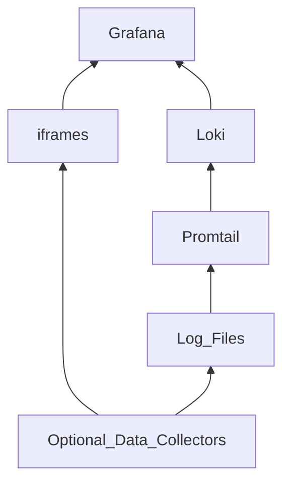
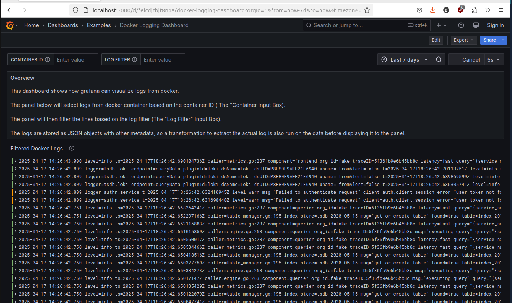
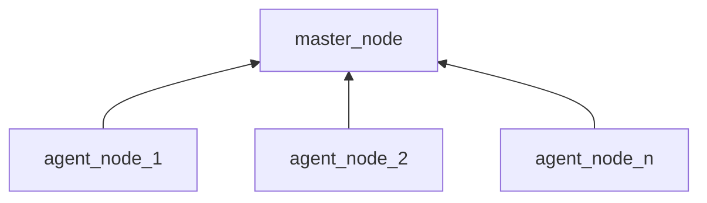

# Grafana Server

Grafana is a powerful visualization and analytics platform that transforms your system's data into beautiful, insightful dashboards. This implementation combines Grafana with Promtail and Loki to create a complete logging and metrics visualization stack, perfect for embedded systems development.

With this setup, Promtail collects your logs, Loki stores and indexes them, and Grafana presents everything in customizable dashboards where you can:

- **Real-time System Monitoring**: Watch CPU usage, memory consumption, and I/O patterns live
- **Hardware Debugging**: Visualize sensor data, communication protocols, and interrupt patterns
- **Log Aggregation**: Centralize logs from multiple embedded devices in one dashboard
- **Custom Alerting**: Set up alerts for critical system events like memory leaks or temperature thresholds
- **Time-Series Analysis**: Track performance metrics over time to identify patterns and anomalies
- **Cross-Device Correlation**: Compare behaviors across different devices or firmware versions

Whether you're working with IoT devices, embedded Linux systems, or any hardware development project, this stack gives you the visibility you need. Visualize any data source - from simple CSV files to complex system logs and real-time metrics.

This proven stack can be quickly deployed using Docker. Simply download the repo. If necessary, use the full docker installation script to install docker and docker compose on your machine. And then, run the server with docker compose easily.



## Dashboard Examples

### Reading in HC-SR04 Data via Arduino->UART


### Basic Docker Logs Visualization (Useful for Build Tools)


# Quick Start

Run the following steps to install docker to proper versions and set the right permissions

```bash
sudo chmod +x *.sh
./full_docker_install.sh
```

The script downloads and runs docker's official installation script. It then will verify the installation. If that passes, you can safely run the following command to run the Grafana server. Finally, the script will configure docker so that it will automatically start on system startup and not necessitate 'sudo'.

You will then need to run the simplest, easiest configuration of the Grafana stack wiht the makefile:
```bash
make simple_stack
```

You can also run the simple stack with docke directly:
```bash
docker compose up -d
```

>**NOTE:** `docker compose up -d` and `docker-compose up -d` are two different commands and the latter might not work.

If this doesn't work, there may be some issue with permissions with the associated volumes or for the ports

You can pull up the example dashboards in Grafana with the following command. You may use firefox or any other browser.

```bash
firefox http://localhost:3000/dashboards
```

# Extended Data Collection

## Overview

There are various "configurations" the Grafana stack can be in. The simple stack is the most likely to work and not conflict with other systems on the host. However, this functionality can be extended.

There are other sources of data beyond log files on a computer, like reading serial ports and live camera feeds. These can be all be enabled with the following make command.

```bash
make full_stack
```

**Be aware. This configuration uses various resources on the host machine (/dev/ttyACM0, /dev/video0, various ports, etc). So, ensure they are available and you don't need them for anything else.**

If you wish to use some extra data sources and not others, please refer to this project's subdirectories. The extended data collectors have READMEs with instructions on how to en/disable them.

# Agent Mode

## Overview
There is a way to have some computers (acting as "agent nodes") in your network collect the data from Promtail and other sources and send the data to a central computer (the "master node") for storing and visualizing the data in Loki and Grafana. 

This configuration is great for running Grafana on a cloud server reading data from agents.



## Quickstart
Setting this up requires two stacks in different configurations, started in the following steps. They also *assume you have the repo on all of the master and agent nodes*:

1. On the computer running the master node, Start a master node on a machine by running `make master_node`.
2. Record the hostname or IP address of the machine running the master node.
3. On all the agent machines collecting and reporting data, set the environment variable `LOKI_IP_ADDR` to the hostname or IP recorded in step 2.
4. Run the command `make simple_agent_node` on the machines. The default Loki datasource should see all the reported logs from the agents, differentiated with the `hostname` tag.
5. *(Optional) To use extra features, run `make full_agent_node` instead on the agent nodes.

# Future Work

The following features will be added in the future. Be sure to star the repo for updates.:

* Containerized dev enviornments to run on agents when using SSH or VNC panels
* MQTT Reading (Likely with InfluxDB)
* Reading in HTTP traffic
* Scraping in Bluetooth/BLE traffic
* Dashboards for interacting with a bus pirate
* Prometheus for visualizing metrics as opposed to just logs
* Dashboards for arduino-as-oscilloscope scraping tool
* More example dashboards (gauges, alerts, plots, etc)
* An interfacing tool & dashboard(s) for controlling and collecting data from some lab power supply test equipment.
* Extending serial-reading to repeatedly poll a REPL/command prompt device with request/response commands for non-headless dat a collection
* Store images in a database
* Create a data collection tool which will use computer vision to determine LED states and create dashboards to graph LED states over time